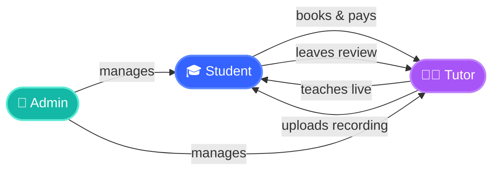
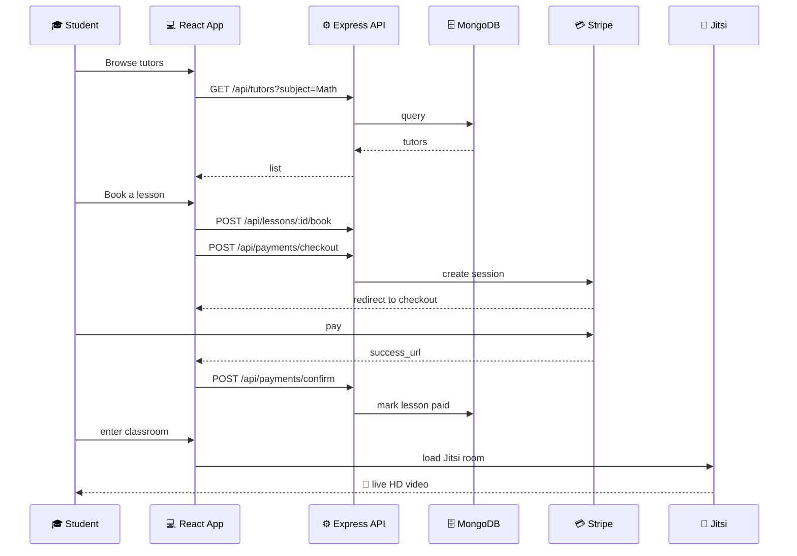

<div align="center">


<br/>

[](#)
[](https://react.dev)
[](https://nodejs.org)
[](https://tailwindcss.com)
[](https://stripe.com)
[](https://meet.jit.si)
[](#license)

<br/>

<a href="#-quickstart"></a>
&nbsp;
<a href="#-screens"></a>
&nbsp;
<a href="#-deployment"></a>
&nbsp;
<a href="#-architecture"></a>

<br/><br/>

<p>
<b>A modern Learning Management System that connects students with vetted tutors for 1-on-1 live HD video lessons.</b><br/>
Schedule. Pay. Learn. Replay. All in one place.
</p>

<br/>


<br/><br/>

</div>

---

## ✨ Why EduMeet

> Built for the modern student. Designed like a product you'd actually pay for.

<table>
<tr>
<td width="33%" valign="top">

### 🎥 Live HD classrooms
Cinematic 1080p video meetings powered by Jitsi. No installs, no friction. Works on any device.

</td>
<td width="33%" valign="top">

### 💳 Pay only for what you take
Stripe-secured checkout. No subscriptions, no surprises, full payment history.

</td>
<td width="33%" valign="top">

### ▶️ Replay anytime
Every lesson is recorded and stored privately. Re-watch whenever you need a refresher.

</td>
</tr>
<tr>
<td width="33%" valign="top">

### 📅 Smart scheduling
Browse live availability. Reschedule or cancel in a click. No more email tag.

</td>
<td width="33%" valign="top">

### 🛡️ Vetted experts only
Every tutor is interviewed and credential-verified. Real PhDs, real engineers, real coaches.

</td>
<td width="33%" valign="top">

### ⭐ Honest reviews
Real students leave real ratings — only after they've actually taken a paid lesson.

</td>
</tr>
</table>

---

## 🧰 Tech Stack

<div align="center">

| Layer | Technology |
|---|---|
| 🎨 **Frontend** | React 18 · Vite · TailwindCSS 3 · Framer Motion · React Router · Lucide Icons |
| ⚙️ **Backend** | Node.js · Express · Mongoose · JWT · Multer |
| 🗄️ **Database** | MongoDB |
| 💳 **Payments** | Stripe Checkout |
| 🎥 **Video** | Jitsi Meet (External API) |
| 🚀 **Deploy** | Netlify (frontend) · Render (backend) |

</div>

---

## 🎭 Roles

<div align="center">



</div>

| Student | Tutor | Admin |
|---|---|---|
| Browse & filter tutors | Set availability | Manage all users |
| Book + pay for lessons | Create lessons | Activate / deactivate |
| Attend HD live classes | Host live classes | Change roles |
| Replay recordings | Upload recordings | Delete accounts |
| Leave reviews | Track earnings | View platform stats |

---

## 🚀 Quickstart

> Get the whole platform running locally in under 3 minutes.

### 1. Clone

```bash
git clone https://github.com/Lokesh-web16/Learning-Management-System.git
cd Learning-Management-System
```

### 2. MongoDB

<details>
<summary><b>Option A — Local MongoDB (macOS)</b></summary>

```bash
brew tap mongodb/brew
brew install mongodb-community
brew services start mongodb-community
```
</details>

<details>
<summary><b>Option B — MongoDB Atlas (free cloud, no install)</b></summary>

1. Create a free cluster at [mongodb.com/atlas](https://www.mongodb.com/cloud/atlas/register)
2. Database Access → add a user
3. Network Access → allow `0.0.0.0/0`
4. Cluster → Connect → copy the connection string
</details>

### 3. Backend

```bash
cd server
cp .env.example .env       # fill in MONGO_URI, JWT_SECRET, STRIPE_SECRET_KEY
npm install
npm run dev                # → API running on :5001
```

### 4. Frontend

```bash
cd client
cp .env.example .env       # set VITE_API_URL=http://localhost:5001/api
npm install
npm run dev                # → http://localhost:5173
```

### 5. Open

```bash
open http://localhost:5173
```

🎉 The app auto-seeds **8 demo tutors with photos, lessons & reviews** on first boot. Try logging in as one of them:

```
sarah.mitchell@demo.com    /  demo1234
marcus.chen@demo.com       /  demo1234
aisha.patel@demo.com       /  demo1234
```

---

## ⚙️ Environment Variables

<details>
<summary><b>📦 server/.env</b></summary>

```ini
PORT=5001
MONGO_URI=mongodb://127.0.0.1:27017/edumeet
JWT_SECRET=a_long_random_secret_here
CLIENT_URL=http://localhost:5173
STRIPE_SECRET_KEY=sk_test_xxxxxxxxxxxx     # optional, leave empty to disable payments
```
</details>

<details>
<summary><b>🎨 client/.env</b></summary>

```ini
VITE_API_URL=http://localhost:5001/api
VITE_STRIPE_PUBLIC_KEY=pk_test_xxxxxxxxxxxx
```
</details>

---

## 🏛 Architecture

```
.
├── client/                          # React + Vite + Tailwind frontend
│   ├── src/
│   │   ├── components/              # Navbar, Footer, TutorCard, SafeImage…
│   │   ├── context/                 # AuthContext (JWT)
│   │   ├── lib/                     # axios api wrapper
│   │   └── pages/                   # Home, TutorList, TutorDetail, Dashboards…
│   └── netlify.toml
│
├── server/                          # Express + Mongoose API
│   ├── src/
│   │   ├── controllers/             # auth, lesson, payment, review, admin…
│   │   ├── middleware/              # auth (JWT) + role guards
│   │   ├── models/                  # User, Lesson, Review, Payment
│   │   ├── routes/                  # /api/auth, /api/lessons, /api/payments…
│   │   └── utils/                   # token, seed
│   └── uploads/                     # lesson recordings (multer)
│
└── render.yaml                      # one-click backend deploy config
```

### Request flow



---

## 🔌 API Reference

<details>
<summary><b>🔐 Auth</b></summary>

| Method | Endpoint | Auth | Purpose |
|---|---|---|---|
| `POST` | `/api/auth/register` | — | Create student or tutor account |
| `POST` | `/api/auth/login` | — | Get JWT |
| `GET` | `/api/auth/me` | ✅ | Current user |
</details>

<details>
<summary><b>👤 Users & Tutors</b></summary>

| Method | Endpoint | Purpose |
|---|---|---|
| `PUT` | `/api/users/me` | Update own profile |
| `GET` | `/api/users/:id` | Get any user |
| `GET` | `/api/tutors` | List + filter (q, subject, minRating, maxPrice, sort) |
| `GET` | `/api/tutors/:id` | Tutor detail |
</details>

<details>
<summary><b>📚 Lessons</b></summary>

| Method | Endpoint | Auth |
|---|---|---|
| `GET` | `/api/lessons` | — |
| `GET` | `/api/lessons/:id` | — |
| `GET` | `/api/lessons/mine/list` | ✅ |
| `POST` | `/api/lessons` | tutor |
| `PUT` | `/api/lessons/:id` | tutor |
| `DELETE` | `/api/lessons/:id` | tutor / admin |
| `POST` | `/api/lessons/:id/book` | student |
| `POST` | `/api/lessons/:id/cancel` | student / tutor |
| `POST` | `/api/lessons/:id/reschedule` | student / tutor |
| `POST` | `/api/lessons/:id/complete` | tutor |
</details>

<details>
<summary><b>💳 Payments</b></summary>

| Method | Endpoint | Auth |
|---|---|---|
| `POST` | `/api/payments/checkout` | student |
| `POST` | `/api/payments/confirm` | ✅ |
| `GET` | `/api/payments/mine` | ✅ |
</details>

<details>
<summary><b>⭐ Reviews</b></summary>

| Method | Endpoint | Auth |
|---|---|---|
| `POST` | `/api/reviews` | student |
| `GET` | `/api/reviews/tutor/:tutorId` | — |
</details>

<details>
<summary><b>🎬 Recordings</b></summary>

| Method | Endpoint | Auth |
|---|---|---|
| `POST` | `/api/recordings/:lessonId` | tutor (multipart `recording` file) |
| `GET` | `/api/recordings/:lessonId` | student / tutor (only their lesson) |
| `DELETE` | `/api/recordings/:lessonId` | tutor |
</details>

<details>
<summary><b>👑 Admin</b></summary>

| Method | Endpoint |
|---|---|
| `GET` | `/api/admin/users` |
| `GET` | `/api/admin/stats` |
| `PUT` | `/api/admin/users/:id/active` |
| `PUT` | `/api/admin/users/:id/role` |
| `DELETE` | `/api/admin/users/:id` |
</details>

---

## 📄 License

MIT, do whatever you want with it.

<div align="center">

<br/>

<sub>Made with ☕, ⌨️ and a lot of refactors.</sub>

<br/>


</div>
